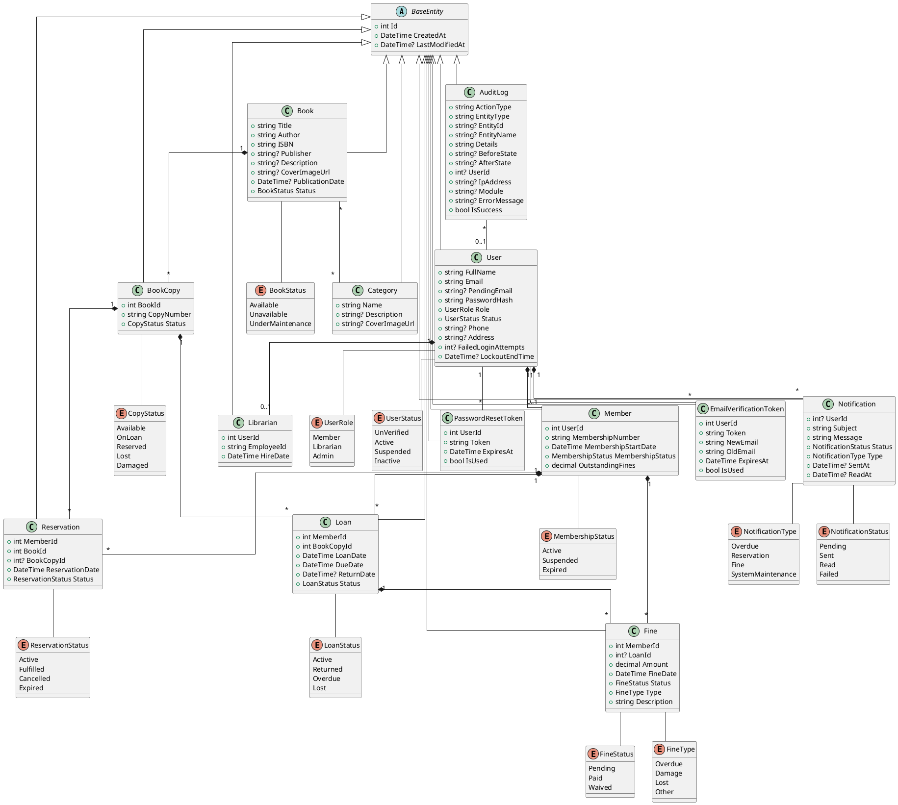

# Library Management System - Class Diagrams

## Domain Model Class Diagram

![Domain Model Class Diagram](https://uml.planttext.com/plantuml/svg/bLTBR-Cs4BuRy7yWSWcmHHRjlO3NYHDiW3mMSR8zqz8aOIEH0abbQwJzxvqXAOaFsTrU4l4RSZZyvkalnd9j-xPXDsAdkTwpMoxv2xGWBTlkZOMMdR6DQhcGx5RLq2mNoyKfszfz0upBcXcmLiWNiroODo4xhddB6Y71xZjWIjjNvK-SSmEiQhZ1dNndhEQLzMidkfHMs3txM2uO-qNWvTUr-znm2u-Y1NQX0J_hjKtW5RlXng9XubbuuJ_-kYS3-an3GsSOa781UBE_a8JXAZG4hMTNVTFSyHPYx18VtKJ0Ydq3MUD7Bc3VKEaFfUkltBmwd2vuKCWG_HcHhUMsDyp_InM_AWa9igvh3SOCTApO5Tu9zOrw4N9jqIsTDJaJgdfJlRsKDQq34_x1jz3knYSJksHEO3YymMynhwAxw-ahPN-IRYbW27SR4fmUbmDkLmsLQ7d3xdkByUOulC8GCOcDFW05bqVDl6oxHkq1yl3uAZHugq80d2lrTZ00I9W6mAEmJUBzTO-XgsFaUdj-btgjtpN2l89Eq0sOIelE2YKJ_4AzusDQJAudtMIkSvegJcT6Qid6B68YjaXweReuOmXAoQ8DaJTfULZZ1LxyelG-vILBYfz-Nl32e-RIOARZxi89DohnjO-Sy83XFMHoxcewDx8qefiU2d357i3sUjfDHmypy00ORk_E2_zbrxHS7RGpKZSQ4667xQ3SE6B0oZ4GraDghLlLoxGsEZtZpRGe2n2XZrIfwK_izyJDmPdRlkkmeXUEl5CMos-L4RUQoTvjl_iJAflM7MCmQ1mKAofjZQMfpPE_jsXRqI8UW4-jmPkyxcjXiPYcmRwk1jr9oN6jAKDN0KxUDu1v9zc0nUgTblnpU5RQUIGh_C_MTmeuGkIANNTnXnXGR8HzavcfjT8noJkb6dPjjdrLkUCHAqCVeoYrZ-eDZjTYjoCDkSk_EYp49hWWN8Kdw-GUrq2_WvxS-J_k6WeJ_2Zwy7rJJzXFstIANkjRP0Bm7njRjxF6vnvzZUs95kkw5KDUZAT2nBfpJz8_3zmZAAxU7VlRtdGuH7ZuMl8Wc1GL3VNZY0B_iZe-7tKDV_8T-U0x7nHFagVB6lGjJdOM99TLOaVKAqezzv8g47tvUkQjkL76KRpXr0KIgwAwcxt75sYlu1uxIDt3f6jIKDRDJ0yESC-YQRoY2thDi9WXAQg5JasOwzmd5-xK7roybuTSsVd8RFNlZHcujsuecCxE5BRyOgfSdX3k3F3ptY4biuP493aDmi-KVeml_NoA0OXs2kknQ0h__U-pCnVI9KhnDOzIn9IIOQee9KDgvNYKQ8L8pQ79itEX9o57OofBwT0SIabP8CizyyND4_v0yoX2bDzOSDpla9FVJjWdF7Vow-VF-3dGCYUBg4d5dqwo9w5PDEB66o8VEH52GJBvQBa8lnJYWvxr6K52_8pSS-_lSxDggNLMbEXTBjoSEATtv23WSzx9znpopZWG3BnundqI33s2wHd_XLJnl_HYP1XT0ZDZoCS_ZfmhGWB5cEE4qcSimu67a0K35e-iQIeCEzmm6H9X3lDpJJB2PGaod3gsnsjPBhvWGUlRvby0 "Domain Model Class Diagram")



## Infrastructure Class Diagram

```plantuml
@startuml Infrastructure Layer

' Style and settings
skinparam linetype ortho

' Packages
package "Infrastructure" {
    class DependencyInjection <<static>> {
        + {static} AddInfrastructure(services: IServiceCollection, configuration: IConfiguration): IServiceCollection
    }
}

package "Infrastructure.Data" {
    class LibraryDbContext {
        + Users: DbSet<User>
        + Members: DbSet<Member>
        + Librarians: DbSet<Librarian>
        + Books: DbSet<Book>
        + BookCopies: DbSet<BookCopy>
        + Categories: DbSet<Category>
        + Loans: DbSet<Loan>
        + Reservations: DbSet<Reservation>
        + Fines: DbSet<Fine>
        + Notifications: DbSet<Notification>
        + PasswordResetTokens: DbSet<PasswordResetToken>
        + EmailVerificationTokens: DbSet<EmailVerificationToken>
        + AuditLogs: DbSet<AuditLog>
        # OnModelCreating(modelBuilder: ModelBuilder): void
    }

    class UnitOfWork {
        - _context: LibraryDbContext
        - _repositories: ConcurrentDictionary<Type, object>
        - _transaction: IDbContextTransaction?
        - _loanRepository: ILoanRepository?
        - _fineRepository: IFineRepository?
        - _auditLogRepository: IAuditLogRepository?
        + LoanRepository: ILoanRepository
        + FineRepository: IFineRepository
        + AuditLogRepository: IAuditLogRepository
        + Repository<T>(): IRepository<T>
        + SaveChangesAsync(cancellationToken): Task<int>
        + BeginTransactionAsync(): Task
        + CommitTransactionAsync(): Task
        + RollbackTransactionAsync(): Task
        + DisposeAsync(): ValueTask
        + Dispose(): void
    }
}

package "Infrastructure.Repositories" {
    class "Repository<T>" {
        # _context: LibraryDbContext
        # _dbSet: DbSet<T>
        + ListAsync(predicate, orderBy, asNoTracking, includes): Task<IReadOnlyList<T>>
        + PagedListAsync(pagedRequest, predicate, orderBy, asNoTracking, includes): Task<PagedResult<T>>
        + AddAsync(entity): Task
        + AddRangeAsync(entities): Task
        + Update(entity): void
        + Delete(entity): void
        + SaveChangesAsync(): Task<int>
        + ExistsAsync(predicate): Task<bool>
        + GetAsync(predicate, includes): Task<T?>
        + CountAsync(predicate): Task<int>
        + Query(): IQueryable<T>
    }
    
    class LoanRepository {
        + GetOverdueLoansAsync(asOfDate): Task<IReadOnlyList<Loan>>
        + GetOverdueLoansPagedAsync(request, asOfDate): Task<PagedResult<Loan>>
    }
    
    class FineRepository {
        + GetUnpaidFinesAsync(): Task<IReadOnlyList<Fine>>
        + GetUnpaidFinesPagedAsync(request): Task<PagedResult<Fine>>
        + GetOutstandingFinesForMemberAsync(memberId): Task<decimal>
    }
    
    class AuditLogRepository {
        + GetAuditLogsPagedAsync(request, from, to, userId, actionType, entityType): Task<PagedResult<AuditLog>>
    }
}

' Interfaces (from Application layer)
package "Application.Interfaces" #DDDDDD {
    interface IUnitOfWork {
        Repository<T>(): IRepository<T>
        SaveChangesAsync(cancellationToken): Task<int>
        BeginTransactionAsync(): Task
        CommitTransactionAsync(): Task
        RollbackTransactionAsync(): Task
        LoanRepository: ILoanRepository
        FineRepository: IFineRepository
        AuditLogRepository: IAuditLogRepository
    }
    
    interface "IRepository<T>" {
        ListAsync(predicate, orderBy, asNoTracking, includes): Task<IReadOnlyList<T>>
        PagedListAsync(pagedRequest, predicate, orderBy, asNoTracking, includes): Task<PagedResult<T>>
        AddAsync(entity): Task
        AddRangeAsync(entities): Task
        Update(entity): void
        Delete(entity): void
        SaveChangesAsync(): Task<int>
        ExistsAsync(predicate): Task<bool>
        GetAsync(predicate, includes): Task<T?>
        CountAsync(predicate): Task<int>
        Query(): IQueryable<T>
    }
    
    interface ILoanRepository {
        GetOverdueLoansAsync(asOfDate): Task<IReadOnlyList<Loan>>
        GetOverdueLoansPagedAsync(request, asOfDate): Task<PagedResult<Loan>>
    }
    
    interface IFineRepository {
        GetUnpaidFinesAsync(): Task<IReadOnlyList<Fine>>
        GetUnpaidFinesPagedAsync(request): Task<PagedResult<Fine>>
        GetOutstandingFinesForMemberAsync(memberId): Task<decimal>
    }
    
    interface IAuditLogRepository {
        GetAuditLogsPagedAsync(request, from, to, userId, actionType, entityType): Task<PagedResult<AuditLog>>
    }
}

' Entity Framework
package "Microsoft.EntityFrameworkCore" #EEEEEE {
    class DbContext {
    }
    
    class DbSet {
    }
}

' Relationships
DbContext <|-- LibraryDbContext

UnitOfWork ..|> IUnitOfWork
UnitOfWork o-- LibraryDbContext
UnitOfWork o-- "0..*" "Repository<T>"
UnitOfWork o-- LoanRepository
UnitOfWork o-- FineRepository
UnitOfWork o-- AuditLogRepository

"Repository<T>" ..|> "IRepository<T>"
"Repository<T>" o-- LibraryDbContext
"Repository<T>" o-- DbSet

LoanRepository --|> "Repository<Loan>"
LoanRepository ..|> ILoanRepository

FineRepository --|> "Repository<Fine>"
FineRepository ..|> IFineRepository

AuditLogRepository --|> "Repository<AuditLog>" 
AuditLogRepository ..|> IAuditLogRepository

@enduml
```

![Infrastructure Class Diagram](https://uml.planttext.com/plantuml/svg/nLZVSzeu47vdXlz1upoKtX7cdZCCAO7aXfcaf8Jq7c-4lH0TiiH9SgwUDl_xIHOsacoeqqdl_88bVRjQQNzyQpv8XONAKefcR2smL2ABLIO0tU8SHBVJxRn33ogdW31Ba0Ib2Dl8RaTk2TjXWLD42GELxm1nePwubRZ7yHPlGEDszWr5lle8VUrsa7vYYgL4KzW1Iu35-Opz1R4YdA7XK9kcI3mQbLZp_8g-skaND4uINsbFWdWcCSWBD7kmhnDEgTNNHp5dQxB913P33Pcuu_TDCdRRbsxdnHpho546KwnmS9vRiX9OvDELtaF15-MVu57RgMsShXv03SrWvAxUGRforktGGrZj1BCALCruk2lEjnN436gh4xuZu47qJEx19bZ1XWi7jf_nORVSDOS7bYp0kAQuw0hap7dO6nrF5SWClDMFN94rYNrLxgI7ljVE-8UBnEobbdmB1vdwaYTvdM92FuEezFhIpSkUXd6M47NBDvLCEU6Wpj2StV44w4G0DfdLIyteAYCq0N61xfoHZj1dJf8g9jruUsH4pTT_SB5r8-qS_HdR-BkeHQI74h3ZagYzbpKYpeG0fgQaI0CjDrpg3EyZlZBPEVA4bT2Un_4-gQeDbeVfImzFTN0ioWrpBNBhJVZWjVQ_1xxn9dmmtb-m9p2kJLw6SNl2cZ0mJzZIvFllMEAdI3axN8vwfXnvCoxq0J_3v0apNM37CcTnByOi1aeFWQZ5brXkXuGfF-TXGvZZ6Ik-HtjPpzEKg3R8XQwMArqPss2dHEeZGRN-6TCCZe1wORoVhC4B9uA3MXnvznYv2NBMAa4qAZ49NERnCYZ6Kja3xGGafXgOF14wOQ_oFiBo8zSt4skstFGHOJ7D4f2bUxIBSJ9dD3TAjDwWTcqWSRIRuGB-pa2gFdhzNlTMNcQqjfCcKhk7JdcYyWR7QSJ2n9i38vLgZzfsYJRgeEZWmRrpWSAfzLfe7ulawo_wPcHmyILunJdrqBz3tKVX1IqlVTxZ6Gk5ZXdpAGEH5pbRlE4LXIfANkoFrnru9SRl3RIbysSGIGO5ere3i9olfyx-VjmKR1iUrrLIkDvg4cK0XIhTy70LDfZlbxsQ-O-wBoH9mUA-2tsh2sOFhNPawqOtcTgePPuftIEoHET1eUg62zj5MNLfyJvBIdq9n2J5zFY1wuMxTkYAx9lkUYrusaUAzr4cpSRwzeiwQJdLve9vRpfWrJIC_4BuJlVh2iGQwtONzSmEQBpRqNqtWgZftjyxzT9P71ma8tGsBPxoGAHSGhFcdg8rJVqeIRMagBO4rPwUMdS2hVk0LtK1NjmTt13DZjFNJwAU_ufulaSxBKddDEMS9foMTFCQidarrRGdcjOqusJnSQvv0wRvMJpZs7-SR7wSQjw2QDwKPfppdkQQ_uTfhWivT2Dm2lgJUUlGoXs91PTyhGOML64ctFp9StPTFC6VFU6_8WsKMtJQplhUaWLO_f1FP2UxdOEcuRVpyuOMljjnM6mm-3PoQSrRv8to0I3wRJ3u9Gg_AEfw0k88baEw29QR2ABR2RzYYiE4v527DH-h2LNSkDafg1ZdvsOZHw38sgY6ixSR7htR2HAufgv8hAY6i-h2g-fs6lAZfhAAv0Wr2bZTpVVy0LYIfVHV "Infrastructure Class Diagram")



## Application Class Diagram

![Application Class Diagram](https://uml.planttext.com/plantuml/svg/nLZVSzeu47vdXlz1upoKtX7cdZCCAO7aXfcaf8Jq7c-4lH0TiiH9SgwUDl_xIHOsacoeqqdl_88bVRjQQNzyQpv8XONAKefcR2smL2ABLIO0tU8SHBVJxRn33ogdW31Ba0Ib2Dl8RaTk2TjXWLD42GELxm1nePwubRZ7yHPlGEDszWr5lle8VUrsa7vYYgL4KzW1Iu35-Opz1R4YdA7XK9kcI3mQbLZp_8g-skaND4uINsbFWdWcCSWBD7kmhnDEgTNNHp5dQxB913P33Pcuu_TDCdRRbsxdnHpho546KwnmS9vRiX9OvDELtaF15-MVu57RgMsShXv03SrWvAxUGRforktGGrZj1BCALCruk2lEjnN436gh4xuZu47qJEx19bZ1XWi7jf_nORVSDOS7bYp0kAQuw0hap7dO6nrF5SWClDMFN94rYNrLxgI7ljVE-8UBnEobbdmB1vdwaYTvdM92FuEezFhIpSkUXd6M47NBDvLCEU6Wpj2StV44w4G0DfdLIyteAYCq0N61xfoHZj1dJf8g9jruUsH4pTT_SB5r8-qS_HdR-BkeHQI74h3ZagYzbpKYpeG0fgQaI0CjDrpg3EyZlZBPEVA4bT2Un_4-gQeDbeVfImzFTN0ioWrpBNBhJVZWjVQ_1xxn9dmmtb-m9p2kJLw6SNl2cZ0mJzZIvFllMEAdI3axN8vwfXnvCoxq0J_3v0apNM37CcTnByOi1aeFWQZ5brXkXuGfF-TXGvZZ6Ik-HtjPpzEKg3R8XQwMArqPss2dHEeZGRN-6TCCZe1wORoVhC4B9uA3MXnvznYv2NBMAa4qAZ49NERnCYZ6Kja3xGGafXgOF14wOQ_oFiBo8zSt4skstFGHOJ7D4f2bUxIBSJ9dD3TAjDwWTcqWSRIRuGB-pa2gFdhzNlTMNcQqjfCcKhk7JdcYyWR7QSJ2n9i38vLgZzfsYJRgeEZWmRrpWSAfzLfe7ulawo_wPcHmyILunJdrqBz3tKVX1IqlVTxZ6Gk5ZXdpAGEH5pbRlE4LXIfANkoFrnru9SRl3RIbysSGIGO5ere3i9olfyx-VjmKR1iUrrLIkDvg4cK0XIhTy70LDfZlbxsQ-O-wBoH9mUA-2tsh2sOFhNPawqOtcTgePPuftIEoHET1eUg62zj5MNLfyJvBIdq9n2J5zFY1wuMxTkYAx9lkUYrusaUAzr4cpSRwzeiwQJdLve9vRpfWrJIC_4BuJlVh2iGQwtONzSmEQBpRqNqtWgZftjyxzT9P71ma8tGsBPxoGAHSGhFcdg8rJVqeIRMagBO4rPwUMdS2hVk0LtK1NjmTt13DZjFNJwAU_ufulaSxBKddDEMS9foMTFCQidarrRGdcjOqusJnSQvv0wRvMJpZs7-SR7wSQjw2QDwKPfppdkQQ_uTfhWivT2Dm2lgJUUlGoXs91PTyhGOML64ctFp9StPTFC6VFU6_8WsKMtJQplhUaWLO_f1FP2UxdOEcuRVpyuOMljjnM6mm-3PoQSrRv8to0I3wRJ3u9Gg_AEfw0k88baEw29QR2ABR2RzYYiE4v527DH-h2LNSkDafg1ZdvsOZHw38sgY6ixSR7htR2HAufgv8hAY6i-h2g-fs6lAZfhAAv0Wr2bZTpVVy0LYIfVHV "Application Class Diagram")


```plantuml
@startuml Application Services Layer

' Style and settings
skinparam linetype ortho

' Packages
package "Application.Interfaces" {
    interface IUserService {
        + CreateUserAsync(request: CreateUserRequest): Task<Result<int>>
        + GetUserDetailsAsync(id: int): Task<Result<UserDetailsDto>>
        + UpdateUserAsync(request: UpdateUserRequest): Task<Result>
        + DeleteUserAsync(id: int): Task<Result>
        + SearchUsersAsync(request: UserSearchRequest): Task<Result<PagedResult<UserBasicDto>>>
        + CheckUserPermissionAsync(actorId: int, targetId: int, action: UserAction): Task<Result>
        + CheckUserRoleAsync(userId: int, requiredRole: UserRole): Task<Result>
        + CanDeleteMemberAsync(memberId: int): Task<Result<MemberDeletionValidationDto>>
        + GetUserDetailsByMemberIdAsync(memberId: int): Task<Result<UserDetailsDto>>
    }
    
    interface IAuthService {
        + LoginAsync(request: LoginRequest): Task<Result<LoginResponse>>
        + RegisterMemberAsync(request: RegisterRequest): Task<Result<int>>
        + ChangePasswordAsync(request: ChangePasswordRequest): Task<Result>
        + RequestPasswordResetAsync(request: ResetPasswordRequest): Task<Result>
        + ConfirmPasswordResetAsync(request: ConfirmResetPasswordRequest): Task<Result>
        + RecordFailedLoginAttemptAsync(email: string): Task<Result<DateTime?>>
        + CheckAccountLockoutStatusAsync(email: string): Task<Result<DateTime?>>
        + ClearFailedLoginAttemptsAsync(userId: int): Task<Result>
        + ValidatePassword(password: string): Result
    }
    
    interface IProfileService {
        + GetProfileAsync(userId: int): Task<Result<ProfileDto>>
        + UpdateProfileAsync(request: UpdateProfileRequest): Task<Result>
        + VerifyEmailChangeAsync(request: VerifyEmailChangeRequest): Task<Result>
    }
    
    interface IEmailService {
        + SendPasswordResetEmailAsync(email: string, fullName: string, resetToken: string): Task<Result>
        + SendEmailVerificationAsync(email: string, fullName: string, verificationToken: string): Task<Result>
        + SendEmailAsync(email: string, subject: string, message: string): Task<Result>
    }
    
    interface IBookService {
        + CreateBookAsync(request: CreateBookRequest): Task<Result<BookDetailDto>>
        + UpdateBookAsync(request: UpdateBookRequest): Task<Result<BookDetailDto>>
        + DeleteBookAsync(id: int): Task<Result<bool>>
        + GetBookByIdAsync(id: int): Task<Result<BookDetailDto>>
        + SearchBooksAsync(request: BookSearchRequest): Task<Result<PagedResult<BookBasicDto>>>
        + IsbnExistsAsync(isbn: string, excludeId: int?): Task<Result<bool>>
        + BookHasActiveLoansAsync(id: int): Task<Result<bool>>
        + BookHasActiveReservationsAsync(id: int): Task<Result<bool>>
    }
    
    interface IBookCopyService {
        + CreateBookCopyAsync(request: CreateBookCopyRequest): Task<Result<BookCopyDetailDto>>
        + CreateMultipleBookCopiesAsync(request: CreateMultipleBookCopiesRequest): Task<Result<IEnumerable<int>>>
        + UpdateBookCopyStatusAsync(request: UpdateBookCopyStatusRequest): Task<Result<BookCopyDetailDto>>
        + DeleteBookCopyAsync(id: int): Task<Result<bool>>
        + GetBookCopyByIdAsync(id: int): Task<Result<BookCopyDetailDto>>
        + GetCopiesByBookIdAsync(bookId: int): Task<Result<IEnumerable<BookCopyBasicDto>>>
        + GenerateUniqueCopyNumberAsync(bookId: int): Task<Result<string>>
        + CopyNumberExistsAsync(bookId: int, copyNumber: string): Task<Result<bool>>
        + CopyHasActiveLoansAsync(id: int): Task<Result<bool>>
        + CopyHasActiveReservationsAsync(id: int): Task<Result<bool>>
    }
    
    interface ICategoryService {
        + CreateCategoryAsync(request: CreateCategoryRequest): Task<Result<CategoryDto>>
        + UpdateCategoryAsync(request: UpdateCategoryRequest): Task<Result<CategoryDto>>
        + DeleteCategoryAsync(id: int): Task<Result<bool>>
        + GetCategoryWithBooksAsync(id: int): Task<Result<CategoryWithBooksDto>>
        + GetCategoriesAsync(request: CategorySearchRequest): Task<Result<PagedResult<CategoryDto>>>
        + GetAllCategoriesAsync(): Task<Result<IEnumerable<CategoryDto>>>
        + CategoryNameExistsAsync(name: string, excludeId: int?): Task<Result<bool>>
        + CategoryHasBooksAsync(id: int): Task<Result<bool>>
    }
    
    interface ILoanService {
        + CreateLoanAsync(request: CreateLoanRequest, allowOverride: bool, overrideReason: string?): Task<Result<LoanDetailDto>>
        + ReturnBookAsync(request: ReturnBookRequest): Task<Result<LoanDetailDto>>
        + RenewLoanAsync(request: RenewLoanRequest, allowOverride: bool, overrideReason: string?): Task<Result<LoanDetailDto>>
        + GetLoanByIdAsync(loanId: int): Task<Result<LoanDetailDto>>
        + GetActiveLoansByMemberIdAsync(memberId: int): Task<Result<IEnumerable<LoanBasicDto>>>
        + GetLoansAsync(request: LoanSearchRequest): Task<Result<PagedResult<LoanBasicDto>>>
        + GetLoansByBookCopyIdAsync(bookCopyId: int): Task<Result<IEnumerable<LoanBasicDto>>>
        + UpdateOverdueLoansAsync(): Task<Result<int>>
        + GetOverdueLoansReportPagedAsync(request: PagedRequest): Task<Result<PagedResult<LoanBasicDto>>>
        + GetOverdueLoansReportAsync(): Task<Result<List<OverdueLoanReportDto>>>
    }
    
    interface IReservationService {
        + CreateReservationAsync(request: CreateReservationRequest): Task<Result<ReservationDetailDto>>
        + CancelReservationAsync(request: CancelReservationRequest, allowOverride: bool, overrideReason: string?): Task<Result<ReservationDetailDto>>
        + FulfillReservationAsync(request: FulfillReservationRequest, allowOverride: bool, overrideReason: string?): Task<Result<ReservationDetailDto>>
        + GetReservationByIdAsync(reservationId: int): Task<Result<ReservationDetailDto>>
        + GetActiveReservationsByMemberIdAsync(memberId: int): Task<Result<IEnumerable<ReservationBasicDto>>>
        + GetReservationsAsync(request: ReservationSearchRequest): Task<Result<PagedResult<ReservationBasicDto>>>
        + GetReservationQueuePositionAsync(reservationId: int): Task<Result<int>>
        + GetActiveReservationsByBookIdAsync(bookId: int): Task<Result<IEnumerable<ReservationBasicDto>>>
        + ProcessExpiredReservationsAsync(): Task<Result<int>>
    }
    
    interface IFineService {
        + CreateFineAsync(request: CreateFineRequest, allowOverride: bool, overrideReason: string?): Task<Result<FineDetailDto>>
        + CalculateFineAsync(request: CalculateFineRequest): Task<Result<FineDetailDto>>
        + PayFineAsync(request: PayFineRequest): Task<Result<FineDetailDto>>
        + WaiveFineAsync(request: WaiveFineRequest, allowOverride: bool, overrideReason: string?): Task<Result<FineDetailDto>>
        + GetFineByIdAsync(fineId: int): Task<Result<FineDetailDto>>
        + GetPendingFinesByMemberIdAsync(memberId: int): Task<Result<IEnumerable<FineBasicDto>>>
        + GetTotalPendingFineAmountAsync(memberId: int): Task<Result<decimal>>
        + GetFinesAsync(request: FineSearchRequest): Task<Result<PagedResult<FineBasicDto>>>
        + GetFinesByLoanIdAsync(loanId: int): Task<Result<IEnumerable<FineBasicDto>>>
        + GenerateOverdueFinesAsync(): Task<Result<int>>
        + GetFinesReportPagedAsync(request: PagedRequest): Task<Result<PagedResult<FineBasicDto>>>
        + GetFinesReportAsync(): Task<Result<List<FinesReportExportDto>>>
        + GetOutstandingFinesAsync(memberId: int): Task<Result<OutstandingFinesDto>>
    }
    
    interface INotificationService {
        + CreateNotificationAsync(dto: NotificationCreateDto): Task<Result<NotificationReadDto>>
        + CreateNotificationsBulkAsync(dto: NotificationBatchCreateDto): Task<Result<List<NotificationReadDto>>>
        + UpdateNotificationStatusAsync(dto: NotificationUpdateStatusDto): Task<Result<NotificationReadDto>>
        + MarkAsReadAsync(dto: NotificationMarkAsReadDto, memberId: int): Task<Result<(int SuccessCount, List<(int Id, string Reason)> Failures)>>
        + GetNotificationsAsync(memberId: int, unreadOnly: bool): Task<Result<List<NotificationListDto>>>
        + GetNotificationDetailAsync(notificationId: int, requesterId: int, isStaff: bool): Task<Result<NotificationReadDto>>
        + GetUnreadCountAsync(memberId: int): Task<Result<int>>
        + SendOverdueNotificationsAsync(): Task<Result<(int SuccessCount, List<string> Errors)>>
        + SendAvailabilityNotificationsAsync(): Task<Result<(int SuccessCount, List<string> Errors)>>
    }
    
    interface IAuditService {
        + CreateAuditLogAsync(request: CreateAuditLogRequest): Task<Result>
        + SearchAuditLogsAsync(request: AuditLogSearchRequest): Task<Result<PagedResult<AuditLogResponse>>>
        + GetDashboardStatsAsync(): Task<Result<DashboardStatsDto>>
    }
    
    interface IReportService {
        + GenerateReportAsync(request: ReportRequestDto): Task<Result<ReportResponseDto>>
    }

    interface IUnitOfWork {
        + Repository<T>(): IRepository<T>
        + SaveChangesAsync(cancellationToken): Task<int>
        + BeginTransactionAsync(): Task
        + CommitTransactionAsync(): Task
        + RollbackTransactionAsync(): Task
        + LoanRepository: ILoanRepository
        + FineRepository: IFineRepository
        + AuditLogRepository: IAuditLogRepository
    }
    
    interface IRepository<T> {
        + ListAsync(predicate, orderBy, asNoTracking, includes): Task<IReadOnlyList<T>>
        + PagedListAsync(pagedRequest, predicate, orderBy, asNoTracking, includes): Task<PagedResult<T>>
        + AddAsync(entity): Task
        + AddRangeAsync(entities): Task
        + Update(entity): void
        + Delete(entity): void
        + SaveChangesAsync(): Task<int>
        + ExistsAsync(predicate): Task<bool>
        + GetAsync(predicate, includes): Task<T?>
        + CountAsync(predicate): Task<int>
        + Query(): IQueryable<T>
    }
    
    interface ILoanRepository {
        + GetOverdueLoansAsync(asOfDate: DateTime): Task<IReadOnlyList<Loan>>
        + GetOverdueLoansPagedAsync(request: PagedRequest, asOfDate: DateTime): Task<PagedResult<Loan>>
    }
    
    interface IFineRepository {
        + GetUnpaidFinesAsync(): Task<IReadOnlyList<Fine>>
        + GetUnpaidFinesPagedAsync(request: PagedRequest): Task<PagedResult<Fine>>
        + GetOutstandingFinesForMemberAsync(memberId: int): Task<decimal>
    }
    
    interface IAuditLogRepository {
        + GetAuditLogsPagedAsync(request: PagedRequest, from: DateTime?, to: DateTime?, userId: int?, actionType: string?, entityType: string?): Task<PagedResult<AuditLog>>
    }
}

package "Application.Services" {
    class UserService {
        - _unitOfWork: IUnitOfWork
        - _mapper: IMapper
        - _authService: IAuthService
        + UserService(unitOfWork, mapper, authService, logger)
    }
    
    class AuthService {
        - _unitOfWork: IUnitOfWork
        - _mapper: IMapper
        - _emailService: IEmailService
        + AuthService(unitOfWork, mapper, emailService, logger)
    }
    
    class ProfileService {
        - _unitOfWork: IUnitOfWork
        - _mapper: IMapper
        - _emailService: IEmailService
        + ProfileService(unitOfWork, mapper, emailService, logger)
    }
    
    class EmailService {
        - _configuration: IConfiguration
        + EmailService(configuration, logger)
    }
    
    class BookService {
        - _unitOfWork: IUnitOfWork
        - _mapper: IMapper
        + BookService(unitOfWork, mapper, logger)
    }
    
    class BookCopyService {
        - _unitOfWork: IUnitOfWork
        - _mapper: IMapper
        + BookCopyService(unitOfWork, mapper, logger)
    }
    
    class CategoryService {
        - _unitOfWork: IUnitOfWork
        - _mapper: IMapper
        + CategoryService(unitOfWork, mapper, logger)
    }
    
    class LoanService {
        - _unitOfWork: IUnitOfWork
        - _mapper: IMapper
        + LoanService(unitOfWork, mapper, logger)
    }
    
    class ReservationService {
        - _unitOfWork: IUnitOfWork
        - _mapper: IMapper
        + ReservationService(unitOfWork, mapper, logger)
    }
    
    class FineService {
        - _unitOfWork: IUnitOfWork
        - _mapper: IMapper
        + FineService(unitOfWork, mapper, logger)
    }
    
    class NotificationService {
        - _unitOfWork: IUnitOfWork
        - _mapper: IMapper
        + NotificationService(unitOfWork, mapper)
    }
    
    class AuditService {
        - _unitOfWork: IUnitOfWork
        - _mapper: IMapper
        + AuditService(unitOfWork, mapper, logger)
    }
    
    class ReportService {
        - _loanService: ILoanService
        - _fineService: IFineService
        - _auditService: IAuditService
        + ReportService(loanService, fineService, auditService)
    }
}

package "Application" {
    class DependencyInjection <<static>> {
        + {static} AddApplication(services: IServiceCollection, configuration: IConfiguration): IServiceCollection
    }
}

package "Application.Common" {
    class Result {
        + IsSuccess: bool
        + Error: string
        + IsFailure: bool
        + {static} Success(): Result
        + {static} Success<T>(value: T): Result<T>
        + {static} Failure(error: string): Result
        + {static} Failure<T>(error: string): Result<T>
    }
    
    class "Result<T>" {
        + Value: T
    }
    
    class "PagedResult<T>" {
        + Items: IReadOnlyList<T>
        + Count: int
        + Page: int
        + PageSize: int
        + TotalPages: int
        + HasPreviousPage: bool
        + HasNextPage: bool
    }
    
    class PagedRequest {
        + Page: int
        + PageSize: int
    }
    
    class PasswordHasher <<static>> {
        + {static} HashPassword(password: string): string
        + {static} VerifyPassword(password: string, hashedPassword: string): bool
    }
}

package "Application.Validators" {
    note "FluentValidation validators for all DTOs" as ValidatorsNote
}

package "Application.Mapping" {
    note "AutoMapper profiles for entity-DTO mappings" as MappingNote
}

package "Application.DTOs" {
    note "Data Transfer Objects for all entities" as DTOsNote
}

package "External Libraries" #DDDDDD {
    interface IMapper {
    }
    
    interface IConfiguration {
    }
}

' Inheritance relationships
IRepository <|-- ILoanRepository
IRepository <|-- IFineRepository
IRepository <|-- IAuditLogRepository
Result <|-- "Result<T>"

UserService ..|> IUserService
AuthService ..|> IAuthService
ProfileService ..|> IProfileService
EmailService ..|> IEmailService
BookService ..|> IBookService
BookCopyService ..|> IBookCopyService
CategoryService ..|> ICategoryService
LoanService ..|> ILoanService
ReservationService ..|> IReservationService
FineService ..|> IFineService
NotificationService ..|> INotificationService
AuditService ..|> IAuditService
ReportService ..|> IReportService

' Dependency relationships
UserService --> IUnitOfWork
UserService --> IMapper
UserService --> IAuthService

AuthService --> IUnitOfWork
AuthService --> IMapper
AuthService --> IEmailService

ProfileService --> IUnitOfWork
ProfileService --> IMapper
ProfileService --> IEmailService

EmailService --> IConfiguration

BookService --> IUnitOfWork
BookService --> IMapper

BookCopyService --> IUnitOfWork
BookCopyService --> IMapper

CategoryService --> IUnitOfWork
CategoryService --> IMapper

LoanService --> IUnitOfWork
LoanService --> IMapper

ReservationService --> IUnitOfWork
ReservationService --> IMapper

FineService --> IUnitOfWork
FineService --> IMapper

NotificationService --> IUnitOfWork
NotificationService --> IMapper

AuditService --> IUnitOfWork
AuditService --> IMapper

ReportService --> ILoanService
ReportService --> IFineService
ReportService --> IAuditService

DependencyInjection ..> UserService : registers
DependencyInjection ..> AuthService : registers
DependencyInjection ..> ProfileService : registers
DependencyInjection ..> EmailService : registers
DependencyInjection ..> BookService : registers
DependencyInjection ..> BookCopyService : registers
DependencyInjection ..> CategoryService : registers
DependencyInjection ..> LoanService : registers
DependencyInjection ..> ReservationService : registers
DependencyInjection ..> FineService : registers
DependencyInjection ..> NotificationService : registers
DependencyInjection ..> AuditService : registers
DependencyInjection ..> ReportService : registers

@enduml
```

## Web Class Diagram

```plantuml
@startuml Web Layer

' Style and settings
skinparam linetype ortho

' Packages
package "Web.Controllers" {
    class BaseController {
        # CreateAuditLog(actionType, entityType, entityId, details): Task
    }

    class HomeController {
        - _logger: ILogger<HomeController>
        - _auditService: IAuditService
        + Index(): IActionResult
        + Privacy(): IActionResult
        + Error(): IActionResult
        + Dashboard(): Task<IActionResult>
    }
    
    class AuthController {
        - _authService: IAuthService
        - _auditService: IAuditService
        - _logger: ILogger<AuthController>
        - _loginValidator: IValidator<LoginRequest>
        - _registerValidator: IValidator<RegisterRequest>
        - _changePasswordValidator: IValidator<ChangePasswordRequest>
        - _resetPasswordValidator: IValidator<ResetPasswordRequest>
        - _confirmResetPasswordValidator: IValidator<ConfirmResetPasswordRequest>
        + Login(returnUrl): IActionResult
        + Login(model, returnUrl): Task<IActionResult>
        + Logout(): Task<IActionResult>
        + Register(): IActionResult
        + Register(model): Task<IActionResult>
        + ForgotPassword(): IActionResult
        + ForgotPassword(model): Task<IActionResult>
        + ResetPassword(email, token): IActionResult
        + ResetPassword(model): Task<IActionResult>
        + ChangePassword(): IActionResult
        + ChangePassword(model): Task<IActionResult>
    }
    
    class UserController {
        - _userService: IUserService
        - _auditService: IAuditService
        - _logger: ILogger<UserController>
        - _createUserValidator: CreateUserRequestValidator
        - _updateUserValidator: UpdateUserRequestValidator
        - _searchValidator: UserSearchRequestValidator
        + Index(searchRequest): Task<IActionResult>
        + Details(id): Task<IActionResult>
        + Create(): Task<IActionResult>
        + Create(model): Task<IActionResult>
        + Edit(id): Task<IActionResult>
        + Edit(model): Task<IActionResult>
        + Delete(id): Task<IActionResult>
        + DeleteConfirmed(id): Task<IActionResult>
    }
    
    class ProfileController {
        - _profileService: IProfileService
        - _auditService: IAuditService
        - _logger: ILogger<ProfileController>
        - _updateProfileValidator: UpdateProfileRequestValidator
        + Index(): Task<IActionResult>
        + Edit(): Task<IActionResult>
        + Edit(model): Task<IActionResult>
        + VerifyEmail(email, token): Task<IActionResult>
    }
    
    class BookController {
        - _bookService: IBookService
        - _categoryService: ICategoryService
        - _auditService: IAuditService
        - _logger: ILogger<BookController>
        - _searchParametersValidator: IValidator<BookSearchRequest>
        - _createBookValidator: IValidator<CreateBookRequest>
        - _updateBookValidator: IValidator<UpdateBookRequest>
        + Index(searchParams): Task<IActionResult>
        + Details(id): Task<IActionResult>
        + Create(): Task<IActionResult>
        + Create(model, CoverImageFile): Task<IActionResult>
        + Edit(id): Task<IActionResult>
        + Edit(model, CoverImageFile, RemoveCoverImage): Task<IActionResult>
        + Delete(id): Task<IActionResult>
        + DeleteConfirmed(id): Task<IActionResult>
        + IsbnExists(isbn, id): Task<IActionResult>
    }
    
    class BookCopyController {
        - _bookCopyService: IBookCopyService
        - _bookService: IBookService
        - _auditService: IAuditService
        - _logger: ILogger<BookCopyController>
        - _createBookCopyValidator: IValidator<CreateBookCopyRequest>
        - _createMultipleBookCopiesValidator: IValidator<CreateMultipleBookCopiesRequest>
        - _updateBookCopyStatusValidator: IValidator<UpdateBookCopyStatusRequest>
        + Details(id): Task<IActionResult>
        + Create(bookId): Task<IActionResult>
        + Create(model): Task<IActionResult>
        + CreateMultiple(bookId): Task<IActionResult>
        + CreateMultiple(model): Task<IActionResult>
        + UpdateStatus(id): Task<IActionResult>
        + UpdateStatus(model): Task<IActionResult>
        + Delete(id): Task<IActionResult>
        + DeleteConfirmed(id): Task<IActionResult>
        - LoadUpdateStatusViewData(copyId): Task
        - GetValidStatusTransitions(currentStatus, hasActiveLoans): List<CopyStatus>
        - IsValidStatusTransition(fromStatus, toStatus): bool
    }
    
    class CategoryController {
        - _categoryService: ICategoryService
        - _auditService: IAuditService
        - _logger: ILogger<CategoryController>
        - _createCategoryValidator: IValidator<CreateCategoryRequest>
        - _updateCategoryValidator: IValidator<UpdateCategoryRequest>
        - _categorySearchValidator: IValidator<CategorySearchRequest>
        + Index(searchParams): Task<IActionResult>
        + Details(id): Task<IActionResult>
        + Create(): IActionResult
        + Create(model, CoverImageFile): Task<IActionResult>
        + Edit(id): Task<IActionResult>
        + Edit(model, CoverImageFile, RemoveCoverImage): Task<IActionResult>
        + Delete(id): Task<IActionResult>
        + DeleteConfirmed(id): Task<IActionResult>
        + GetCategoriesForSelection(): Task<IActionResult>
    }
    
    class LoanController {
        - _loanService: ILoanService
        - _bookCopyService: IBookCopyService
        - _fineService: IFineService
        - _auditService: IAuditService
        - _logger: ILogger<LoanController>
        - _createLoanValidator: IValidator<CreateLoanRequest>
        - _returnBookValidator: IValidator<ReturnBookRequest>
        - _renewLoanValidator: IValidator<RenewLoanRequest>
        - _notificationService: INotificationService
        + Index(search): Task<IActionResult>
        + Details(id): Task<IActionResult>
        + MemberLoans(memberId, page, pageSize): Task<IActionResult>
        + Checkout(): IActionResult
        + Checkout(model, allowOverride, overrideReason): Task<IActionResult>
        + Return(id): Task<IActionResult>
        + Return(model): Task<IActionResult>
        + Renew(id): Task<IActionResult>
        + Renew(model, allowOverride, overrideReason): Task<IActionResult>
        + MyLoans(page, pageSize): Task<IActionResult>
        + MyLoanDetails(id): Task<IActionResult>
        + RequestRenewal(id): Task<IActionResult>
        + OverdueReport(page, pageSize): Task<IActionResult>
        + DownloadOverdueReportCsv(): Task<IActionResult>
    }
    
    class FineController {
        - _fineService: IFineService
        - _loanService: ILoanService
        - _auditService: IAuditService
        - _notificationService: INotificationService
        - _logger: ILogger<FineController>
        - _createFineValidator: IValidator<CreateFineRequest>
        - _calculateFineValidator: IValidator<CalculateFineRequest>
        - _payFineValidator: IValidator<PayFineRequest>
        - _waiveFineValidator: IValidator<WaiveFineRequest>
        + Index(search): Task<IActionResult>
        + Details(id): Task<IActionResult>
        + MemberFines(memberId, page, pageSize): Task<IActionResult>
        + LoanFines(loanId): Task<IActionResult>
        + Create(memberId, loanId): Task<IActionResult>
        + Create(model, allowOverride, overrideReason): Task<IActionResult>
        + Calculate(loanId): Task<IActionResult>
        + Calculate(model): Task<IActionResult>
        + Pay(id): Task<IActionResult>
        + Pay(model): Task<IActionResult>
        + Waive(id): Task<IActionResult>
        + Waive(model, allowOverride, overrideReason): Task<IActionResult>
        + MyFines(page, pageSize): Task<IActionResult>
        + MyFineDetails(id): Task<IActionResult>
        + FinesReport(page, pageSize): Task<IActionResult>
        + DownloadFinesReportCsv(): Task<IActionResult>
        + OutstandingFines(memberId): Task<IActionResult>
    }
    
    class ReservationController {
        - _reservationService: IReservationService
        - _bookService: IBookService
        - _auditService: IAuditService
        - _notificationService: INotificationService
        - _logger: ILogger<ReservationController>
        - _createReservationValidator: IValidator<CreateReservationRequest>
        - _cancelReservationValidator: IValidator<CancelReservationRequest>
        - _fulfillReservationValidator: IValidator<FulfillReservationRequest>
        + Index(search): Task<IActionResult>
        + Details(id): Task<IActionResult>
        + MemberReservations(memberId, page, pageSize): Task<IActionResult>
        + BookReservations(bookId, page, pageSize): Task<IActionResult>
        + Create(bookId): Task<IActionResult>
        + Create(model): Task<IActionResult>
        + Cancel(model, allowOverride, overrideReason): Task<IActionResult>
        + Fulfill(id): Task<IActionResult>
        + Fulfill(model, allowOverride, overrideReason): Task<IActionResult>
        + MyReservations(page, pageSize): Task<IActionResult>
        + MyReservationDetails(id): Task<IActionResult>
        + ReserveBook(model): Task<IActionResult>
        + CancelMyReservation(model): Task<IActionResult>
    }
    
    class NotificationController {
        - _notificationService: INotificationService
        - _auditService: IAuditService
        + Index(unreadOnly): Task<IActionResult>
        + Details(id): Task<IActionResult>
        + Create(dto): Task<IActionResult>
        + CreateBulk(dto): Task<IActionResult>
        + UpdateStatus(dto): Task<IActionResult>
        + MarkAsRead(dto): Task<IActionResult>
        + UnreadCount(): Task<IActionResult>
        + TriggerOverdueJob(): Task<IActionResult>
        + TriggerAvailabilityJob(): Task<IActionResult>
    }
    
    class ReportsController {
        - _reportService: IReportService
        - _auditService: IAuditService
        - _logger: ILogger<ReportsController>
        + Index(): IActionResult
        + Generate(request): Task<IActionResult>
    }
    
    class AuditController {
        - _auditService: IAuditService
        + Index(search): Task<IActionResult>
        + ExportCsv(search): Task<IActionResult>
    }
}

package "Web.Services" {
    class NotificationJobService {
        - _serviceProvider: IServiceProvider
        - _logger: ILogger<NotificationJobService>
        # ExecuteAsync(stoppingToken): Task
    }
}

package "Web.Extensions" {
    class ValidationExtensions <<static>> {
        + {static} AddToModelState(result: ValidationResult, modelState: ModelStateDictionary): void
    }
    
    class MapperExtensions <<static>> {
        - {static} _mapper: IMapper
        + {static} SafeMapToExportDto(response: AuditLogResponse): AuditLogExportDto
    }
    
    class ClaimExtensions <<static>> {
        + {static} TryGetUserId(claimsPrincipal: ClaimsPrincipal, out userId: int): bool
        + {static} GetUserId(claimsPrincipal: ClaimsPrincipal): int?
        + {static} TryGetFullName(claimsPrincipal: ClaimsPrincipal, out fullName: string): bool
        + {static} GetFullName(claimsPrincipal: ClaimsPrincipal): string?
    }
}

package "Web.Configuration" {
    class Program <<static>> {
        + {static} Main(args: string[]): void
    }
}

package "Application.Interfaces" #DDDDDD {
    interface IUserService {}
    interface IAuthService {}
    interface IProfileService {}
    interface IBookService {}
    interface IBookCopyService {}
    interface ICategoryService {}
    interface ILoanService {}
    interface IFineService {}
    interface IReservationService {}
    interface INotificationService {}
    interface IReportService {}
    interface IAuditService {}
}

package "Microsoft.Extensions.Hosting" #EEEEEE {
    class BackgroundService {}
}

package "Microsoft.AspNetCore.Mvc" #EEEEEE {
    class Controller {}
    interface IActionResult {}
}

' Inheritance relationships
BackgroundService <|-- NotificationJobService
Controller <|-- BaseController
BaseController <|-- HomeController
BaseController <|-- AuthController
BaseController <|-- UserController
BaseController <|-- ProfileController
BaseController <|-- BookController
BaseController <|-- BookCopyController
BaseController <|-- CategoryController
BaseController <|-- LoanController
BaseController <|-- FineController
BaseController <|-- ReservationController
BaseController <|-- NotificationController
BaseController <|-- ReportsController
BaseController <|-- AuditController

' Dependencies relationships
HomeController --> IAuditService
AuthController --> IAuthService
AuthController --> IAuditService
UserController --> IUserService
UserController --> IAuditService
ProfileController --> IProfileService
ProfileController --> IAuditService
BookController --> IBookService
BookController --> ICategoryService
BookController --> IAuditService
BookCopyController --> IBookCopyService
BookCopyController --> IBookService
BookCopyController --> IAuditService
CategoryController --> ICategoryService
CategoryController --> IAuditService
LoanController --> ILoanService
LoanController --> IBookCopyService
LoanController --> IFineService
LoanController --> INotificationService
LoanController --> IAuditService
FineController --> IFineService
FineController --> ILoanService
FineController --> INotificationService
FineController --> IAuditService
ReservationController --> IReservationService
ReservationController --> IBookService
ReservationController --> INotificationService
ReservationController --> IAuditService
NotificationController --> INotificationService
NotificationController --> IAuditService
ReportsController --> IReportService
ReportsController --> IAuditService
AuditController --> IAuditService

NotificationJobService --> INotificationService
Program --> NotificationJobService

' Use relationships
AuthController ..> ValidationExtensions
AuthController ..> ClaimExtensions
UserController ..> ValidationExtensions
UserController ..> ClaimExtensions
ProfileController ..> ValidationExtensions
ProfileController ..> ClaimExtensions
BookController ..> ValidationExtensions
BookController ..> ClaimExtensions
BookCopyController ..> ValidationExtensions
BookCopyController ..> ClaimExtensions
CategoryController ..> ValidationExtensions
CategoryController ..> ClaimExtensions
LoanController ..> ValidationExtensions
LoanController ..> ClaimExtensions
FineController ..> ValidationExtensions
FineController ..> ClaimExtensions
ReservationController ..> ValidationExtensions
ReservationController ..> ClaimExtensions
NotificationController ..> ClaimExtensions
AuditController ..> ClaimExtensions
AuditController ..> MapperExtensions

@enduml
```

![Web Class Diagram](https://uml.planttext.com/plantuml/svg/nLZVSzeu47vdXlz1upoKtX7cdZCCAO7aXfcaf8Jq7c-4lH0TiiH9SgwUDl_xIHOsacoeqqdl_88bVRjQQNzyQpv8XONAKefcR2smL2ABLIO0tU8SHBVJxRn33ogdW31Ba0Ib2Dl8RaTk2TjXWLD42GELxm1nePwubRZ7yHPlGEDszWr5lle8VUrsa7vYYgL4KzW1Iu35-Opz1R4YdA7XK9kcI3mQbLZp_8g-skaND4uINsbFWdWcCSWBD7kmhnDEgTNNHp5dQxB913P33Pcuu_TDCdRRbsxdnHpho546KwnmS9vRiX9OvDELtaF15-MVu57RgMsShXv03SrWvAxUGRforktGGrZj1BCALCruk2lEjnN436gh4xuZu47qJEx19bZ1XWi7jf_nORVSDOS7bYp0kAQuw0hap7dO6nrF5SWClDMFN94rYNrLxgI7ljVE-8UBnEobbdmB1vdwaYTvdM92FuEezFhIpSkUXd6M47NBDvLCEU6Wpj2StV44w4G0DfdLIyteAYCq0N61xfoHZj1dJf8g9jruUsH4pTT_SB5r8-qS_HdR-BkeHQI74h3ZagYzbpKYpeG0fgQaI0CjDrpg3EyZlZBPEVA4bT2Un_4-gQeDbeVfImzFTN0ioWrpBNBhJVZWjVQ_1xxn9dmmtb-m9p2kJLw6SNl2cZ0mJzZIvFllMEAdI3axN8vwfXnvCoxq0J_3v0apNM37CcTnByOi1aeFWQZ5brXkXuGfF-TXGvZZ6Ik-HtjPpzEKg3R8XQwMArqPss2dHEeZGRN-6TCCZe1wORoVhC4B9uA3MXnvznYv2NBMAa4qAZ49NERnCYZ6Kja3xGGafXgOF14wOQ_oFiBo8zSt4skstFGHOJ7D4f2bUxIBSJ9dD3TAjDwWTcqWSRIRuGB-pa2gFdhzNlTMNcQqjfCcKhk7JdcYyWR7QSJ2n9i38vLgZzfsYJRgeEZWmRrpWSAfzLfe7ulawo_wPcHmyILunJdrqBz3tKVX1IqlVTxZ6Gk5ZXdpAGEH5pbRlE4LXIfANkoFrnru9SRl3RIbysSGIGO5ere3i9olfyx-VjmKR1iUrrLIkDvg4cK0XIhTy70LDfZlbxsQ-O-wBoH9mUA-2tsh2sOFhNPawqOtcTgePPuftIEoHET1eUg62zj5MNLfyJvBIdq9n2J5zFY1wuMxTkYAx9lkUYrusaUAzr4cpSRwzeiwQJdLve9vRpfWrJIC_4BuJlVh2iGQwtONzSmEQBpRqNqtWgZftjyxzT9P71ma8tGsBPxoGAHSGhFcdg8rJVqeIRMagBO4rPwUMdS2hVk0LtK1NjmTt13DZjFNJwAU_ufulaSxBKddDEMS9foMTFCQidarrRGdcjOqusJnSQvv0wRvMJpZs7-SR7wSQjw2QDwKPfppdkQQ_uTfhWivT2Dm2lgJUUlGoXs91PTyhGOML64ctFp9StPTFC6VFU6_8WsKMtJQplhUaWLO_f1FP2UxdOEcuRVpyuOMljjnM6mm-3PoQSrRv8to0I3wRJ3u9Gg_AEfw0k88baEw29QR2ABR2RzYYiE4v527DH-h2LNSkDafg1ZdvsOZHw38sgY6ixSR7htR2HAufgv8hAY6i-h2g-fs6lAZfhAAv0Wr2bZTpVVy0LYIfVHV "Web Class Diagram")

